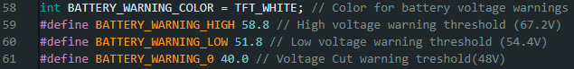
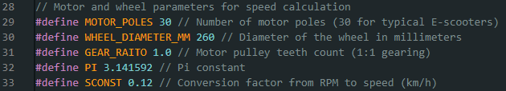

# SimpleVESCDisplay - Firmwares Personalizados para Scooters Eléctricos

**Descripción:**  
Firmwares de SimpleVESCDisplay listos para diferentes modelos de scooters eléctricos, con configuración personalizable.

**Modelos disponibles:**  
- [Cecotec](MODELOS/Cecotec)
- [KuKirin](MODELOS/KuKirin)
- [Ninebot](MODELOS/Ninebot)
  
*(Puedes agregar más modelos según tus adaptaciones)*

**Instrucciones de uso:**  
1. En la parte superior del repositorio, dentro de cada carpeta, encontrarás el firmware específico para tu modelo de scooter.
2. Selecciona la carpeta correspondiente a tu modelo de scooter.  
3. Abre el archivo principal `main.ide`.  
4. Configura los parámetros según tu vehículo:  
   - Voltaje de la batería 
   
    
   - Tamaño de la rueda  
   - Número de imanes  
   - Relación de engranajes si tu motor es con reductor  
   - Otros parámetros importantes para el correcto funcionamiento 
   
   

5. Compila y sube el firmware a tu pantalla/display ESP32.  

**Notas:**  
- URL para añadir placa a Arduino IDE: https://randomnerdtutorials.com/installing-the-esp32-board-in-arduino-ide-windows-instructions/
- Este repositorio es una adaptación del proyecto original [SimpleVescDisplay](https://github.com/NetworkDir/SimpleVescDisplay).  
- Autor de esta adaptación: *ds.lm.ua*  

**Licencia:**  
Revisa la licencia del proyecto original y respeta los términos de uso.
